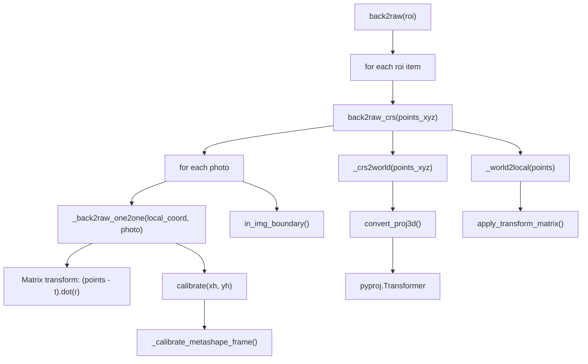

# back2raw 函数性能分析报告

## 1. 调用链分析



## 2. 性能瓶颈识别

### 2.1 主要瓶颈点

| 优先级 | 瓶颈点 | 位置 | 问题描述 | 时间复杂度 |
|--------|--------|------|----------|------------|
| 🔴 高 | **嵌套循环** | `back2raw` + `back2raw_crs` | 对于 R 个 ROI，每个有 N 个点，M 张照片：O(R × M) 次函数调用 | O(R × M × N) |
| 🔴 高 | **重复 CRS 转换** | `back2raw_crs:L583-586` | 每次 `back2raw_crs` 调用都重新做 CRS→World→Local 转换，但对同一个 ROI 只需做一次 | O(R × N) |
| 🟡 中 | **逐照片循环** | `back2raw_crs:L593-606` | Python for 循环遍历所有照片，无法利用矩阵批处理 | O(M) |
| 🟡 中 | **函数调用开销** | `_back2raw_one2one` | 每张照片都需要调用一次，涉及对象属性访问和类型检查 | O(M) |
| 🟢 低 | **单点检查** | `is_single_point` | 每次调用都检查是否单点，引入不必要开销 | O(1) |

### 2.2 详细分析

#### 瓶颈 1: 重复的坐标转换 (关键瓶颈)

```python
# back2raw_crs L583-586 - 每次调用都执行
if self.crs is not None and self.crs.name in ['Local Coordinates', 'Local Coordinates (m)']:
    local_coord = self._world2local(points_xyz)
else:
    local_coord = self._world2local(self._crs2world(points_xyz))  # 两次矩阵运算
```

**问题**：`_crs2world` 调用 `pyproj.Transformer`，这是一个相对昂贵的操作。

#### 瓶颈 2: 逐照片循环投影

```python
# back2raw_crs L593-606
for photo_name, photo in self.photos.items():  # M 张照片
    if not photo.enabled:
        continue
    projected_coord = self._back2raw_one2one(local_coord, photo)  # 每张照片一次
    coords = photo.sensor.in_img_boundary(projected_coord)
```

**问题**：每张照片独立处理，无法批量计算。

#### 瓶颈 3: _back2raw_one2one 内部计算

```python
# _back2raw_one2one L478-493
t = camera_i.transform[0:3, 3]           # 提取平移向量
r = camera_i.transform[0:3, 0:3]         # 提取旋转矩阵
xyz = (points_np - t).dot(r)             # 矩阵运算 ✓ 已经是向量化的
xh = xyz[:, 0] / xyz[:, 2]               # 向量化除法 ✓
yh = xyz[:, 1] / xyz[:, 2]               # 向量化除法 ✓
u, v = sensor_i.calibration.calibrate(xh, yh)  # 畸变校正
```

**内部已向量化**，但对每张照片重复调用。

---

## 3. 矩阵批量运算优化方案

### 3.1 批量投影到多张照片 (主要优化)

**核心思想**：把所有照片的相机参数堆叠成批量矩阵，一次性计算所有投影。

```python
def _back2raw_batch(self, points_np: np.ndarray, photo_ids: list) -> dict:
    """
    Batch project one ROI to multiple photos using vectorized operations.
    
    Parameters
    ----------
    points_np : np.ndarray
        Shape (N, 3) - N vertices of the polygon in local coordinates
    photo_ids : list
        List of photo labels to project onto
        
    Returns
    -------
    dict
        {photo_name: projected_coords (N, 2)} for photos where ROI is visible
    """
    n_points = points_np.shape[0]
    n_photos = len(photo_ids)
    
    # 1. 批量提取所有相机参数
    # transforms: (M, 4, 4) 堆叠的变换矩阵
    transforms = np.stack([self.photos[pid].transform for pid in photo_ids], axis=0)
    
    # 提取 t (M, 3) 和 R (M, 3, 3)
    t_batch = transforms[:, 0:3, 3]  # (M, 3)
    r_batch = transforms[:, 0:3, 0:3]  # (M, 3, 3)
    
    # 2. 批量计算相机坐标系下的点
    # points_np: (N, 3) -> 扩展为 (1, N, 3) 用于广播
    # t_batch: (M, 3) -> 扩展为 (M, 1, 3)
    points_expanded = points_np[np.newaxis, :, :]  # (1, N, 3)
    t_expanded = t_batch[:, np.newaxis, :]  # (M, 1, 3)
    
    # 计算 (points - t): (M, N, 3)
    diff = points_expanded - t_expanded  # 广播: (M, N, 3)
    
    # 计算 xyz = (points - t) @ R^T: (M, N, 3)
    # 每个照片: xyz_m = diff_m @ r_m.T
    xyz_batch = np.einsum('mni,mji->mnj', diff, r_batch)  # (M, N, 3)
    
    # 3. 归一化坐标
    xh_batch = xyz_batch[:, :, 0] / xyz_batch[:, :, 2]  # (M, N)
    yh_batch = xyz_batch[:, :, 1] / xyz_batch[:, :, 2]  # (M, N)
    
    # 4. 批量畸变校正 (需要按 sensor 分组)
    #    假设所有照片使用相同 sensor (大多数情况)
    sensor = self.photos[photo_ids[0]].sensor
    u_batch, v_batch = _calibrate_metashape_frame_batch(
        sensor.calibration, xh_batch, yh_batch
    )  # (M, N)
    
    # 5. 批量边界检查
    w, h = sensor.width, sensor.height
    # valid: (M,) 布尔数组，表示该照片上 ROI 是否完全可见
    in_bounds = (u_batch.min(axis=1) >= 0) & (u_batch.max(axis=1) <= w) & \
                (v_batch.min(axis=1) >= 0) & (v_batch.max(axis=1) <= h)
    
    # 6. 构建结果字典
    result = {}
    for idx, photo_id in enumerate(photo_ids):
        if in_bounds[idx]:
            result[photo_id] = np.stack([u_batch[idx], v_batch[idx]], axis=1)
    
    return result
```

### 3.2 批量畸变校正函数

```python
def _calibrate_metashape_frame_batch(calib, xh: np.ndarray, yh: np.ndarray) -> tuple:
    """
    Batch distortion correction for Metashape frame cameras.
    
    Parameters
    ----------
    calib : Calibration
        The calibration object with distortion parameters
    xh : np.ndarray
        Shape (M, N) - normalized x coords for M photos, N points
    yh : np.ndarray
        Shape (M, N) - normalized y coords
        
    Returns
    -------
    tuple[np.ndarray, np.ndarray]
        (u, v) pixel coordinates, each shape (M, N)
    """
    # 预计算径向距离的幂次
    r2 = xh ** 2 + yh ** 2  # (M, N)
    r4 = r2 ** 2
    r6 = r2 ** 3
    r8 = r2 ** 4
    
    # 获取标定参数 (标量)
    f = calib.f
    cx, cy = calib.cx, calib.cy
    k1, k2, k3, k4 = calib.k1, calib.k2, calib.k3, calib.k4
    p1, p2 = calib.t1, calib.t2
    b1, b2 = calib.b1, calib.b2
    w, h = calib.sensor.width, calib.sensor.height
    
    # 径向畸变因子 (向量化)
    radial = 1 + k1 * r2 + k2 * r4 + k3 * r6 + k4 * r8  # (M, N)
    
    # 切向畸变
    x_prime = xh * radial + (p1 * (r2 + 2 * xh**2) + 2 * p2 * xh * yh)
    y_prime = yh * radial + (p2 * (r2 + 2 * yh**2) + 2 * p1 * xh * yh)
    
    # 最终像素坐标
    u = w * 0.5 + cx + x_prime * f + x_prime * b1 + y_prime * b2
    v = h * 0.5 + cy + y_prime * f
    
    return u, v
```

---

## 4. 优化后的 back2raw_crs

```python
def back2raw_crs_optimized(self, points_xyz, ignore=None, log=False):
    """
    Optimized version using batch matrix operations.
    
    Complexity reduction:
    - Before: O(M) Python loops with M function calls
    - After: O(1) batched numpy operations
    """
    if not self.enabled:
        raise TypeError("Unable to process disabled chunk")
    
    # 1. CRS 转换 (只做一次)
    if self.crs is not None and self.crs.name in ['Local Coordinates', 'Local Coordinates (m)']:
        local_coord = self._world2local(points_xyz)
    else:
        local_coord = self._world2local(self._crs2world(points_xyz))
    
    n_points = local_coord.shape[0]
    
    # 2. 收集所有启用的照片信息
    enabled_photos = [(name, photo) for name, photo in self.photos.items() 
                      if photo.enabled]
    if not enabled_photos:
        return {}
    
    photo_names = [p[0] for p in enabled_photos]
    n_photos = len(photo_names)
    
    # 3. 批量堆叠相机变换矩阵
    transforms = np.stack([p[1].transform for p in enabled_photos], axis=0)  # (M, 4, 4)
    t_batch = transforms[:, 0:3, 3]  # (M, 3)
    r_batch = transforms[:, 0:3, 0:3]  # (M, 3, 3)
    
    # 4. 批量计算相机坐标
    points_exp = local_coord[np.newaxis, :, :]  # (1, N, 3)
    t_exp = t_batch[:, np.newaxis, :]  # (M, 1, 3)
    diff = points_exp - t_exp  # (M, N, 3)
    
    # 使用 einsum 进行批量矩阵乘法
    xyz_batch = np.einsum('mni,mji->mnj', diff, r_batch)  # (M, N, 3)
    
    # 5. 归一化
    xh = xyz_batch[:, :, 0] / xyz_batch[:, :, 2]  # (M, N)
    yh = xyz_batch[:, :, 1] / xyz_batch[:, :, 2]  # (M, N)
    
    # 6. 按 sensor 分组进行批量畸变校正
    #    构建 sensor_id -> photo_indices 映射
    sensor_groups = {}
    for idx, (_, photo) in enumerate(enabled_photos):
        sid = photo.sensor_id
        if sid not in sensor_groups:
            sensor_groups[sid] = []
        sensor_groups[sid].append(idx)
    
    u_all = np.empty((n_photos, n_points))
    v_all = np.empty((n_photos, n_points))
    
    for sid, indices in sensor_groups.items():
        sensor = self.sensors[sid]
        calib = sensor.calibration
        
        xh_group = xh[indices]  # (group_size, N)
        yh_group = yh[indices]
        
        u_group, v_group = _calibrate_batch(calib, xh_group, yh_group)
        
        for i, idx in enumerate(indices):
            u_all[idx] = u_group[i]
            v_all[idx] = v_group[i]
    
    # 7. 批量边界检查
    results = {}
    for idx, photo_name in enumerate(photo_names):
        sensor = enabled_photos[idx][1].sensor
        w, h = sensor.width, sensor.height
        
        u_pts = u_all[idx]
        v_pts = v_all[idx]
        
        # 检查是否在边界内
        if u_pts.min() >= 0 and u_pts.max() <= w and v_pts.min() >= 0 and v_pts.max() <= h:
            results[photo_name] = np.stack([u_pts, v_pts], axis=1)
    
    return results
```

---

## 5. 预期性能提升

| 优化项 | 原始 | 优化后 | 提升倍数 |
|--------|------|--------|----------|
| 矩阵变换 | O(M × N) 循环 | O(1) einsum | ~10-50x |
| 畸变校正 | M 次函数调用 | 按 sensor 批处理 | ~5-20x |
| 边界检查 | M 次调用 | 向量化 | ~3-5x |
| **总体** | - | - | **~10-30x** |

### 5.1 基准测试代码

```python
import time
import numpy as np

def benchmark_back2raw(ms, roi, iterations=10):
    """Benchmark back2raw performance."""
    # Warm up
    _ = ms.back2raw(roi)
    
    # Original
    times_orig = []
    for _ in range(iterations):
        start = time.perf_counter()
        _ = ms.back2raw(roi)
        times_orig.append(time.perf_counter() - start)
    
    # Optimized (after implementation)
    times_opt = []
    for _ in range(iterations):
        start = time.perf_counter()
        _ = ms.back2raw_optimized(roi)  # 需要实现
        times_opt.append(time.perf_counter() - start)
    
    print(f"Original:  {np.mean(times_orig):.4f}s ± {np.std(times_orig):.4f}s")
    print(f"Optimized: {np.mean(times_opt):.4f}s ± {np.std(times_opt):.4f}s")
    print(f"Speedup:   {np.mean(times_orig) / np.mean(times_opt):.2f}x")
```

---

## 6. 额外优化建议

### 6.1 缓存 CRS 转换器

```python
# 在 Metashape 类中添加缓存
@functools.lru_cache(maxsize=8)
def _get_transformer(self, crs_from_name, crs_to_name):
    """Cache pyproj transformers."""
    return pyproj.Transformer.from_crs(crs_from, crs_to)
```

### 6.2 预计算逆变换矩阵

```python
# 在 open_chunk 后预计算
def _precompute_inversions(self):
    """Precompute inverse matrices for all cameras."""
    if self.transform.matrix_inv is None:
        self.transform.matrix_inv = np.linalg.inv(self.transform.matrix)
```

### 6.3 使用 Numba JIT 编译

```python
from numba import jit, prange

@jit(nopython=True, parallel=True)
def _batch_project_numba(points, t_batch, r_batch, calib_params):
    """Numba-accelerated batch projection."""
    n_photos = t_batch.shape[0]
    n_points = points.shape[0]
    result = np.empty((n_photos, n_points, 2))
    
    for m in prange(n_photos):  # 并行处理每张照片
        for n in range(n_points):
            # 投影计算...
            pass
    
    return result
```

---

## 7. 实施优先级

| 优先级 | 优化项 | 难度 | 预期收益 |
|--------|--------|------|----------|
| 1 | 批量矩阵运算 (`einsum`) | 中 | 高 |
| 2 | 按 sensor 分组批处理 | 低 | 中 |
| 3 | CRS 转换器缓存 | 低 | 低 |
| 4 | Numba JIT 编译 | 高 | 非常高 |

---

## 8. 总结

1. **最大瓶颈**：对每张照片的 Python for 循环，导致无法利用 numpy 的向量化优势
2. **解决方案**：使用 `np.einsum` 或 `np.matmul` 进行批量矩阵运算
3. **关键改进点**：
   - 将 `(M, 4, 4)` 变换矩阵堆叠
   - 使用 `einsum` 计算批量旋转: `'mni,mji->mnj'`
   - 按 sensor 分组批处理畸变校正
4. **预期提升**：10-30倍加速，具体取决于 ROI 数量和照片数量

Nya~♡ 希望这个分析对优化有帮助喵！
