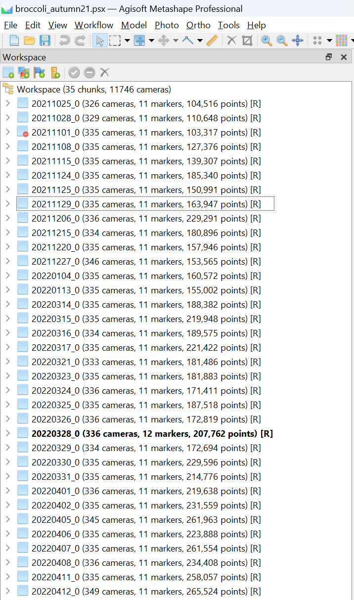
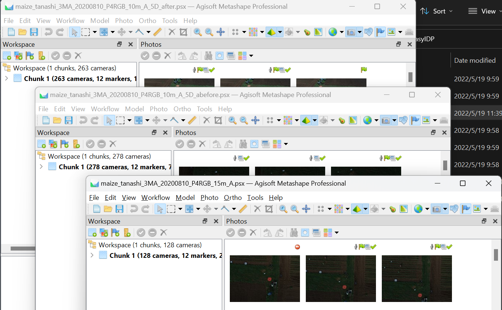

<div align="center">

<p>
   <!-- <a align="left" href="https://ultralytics.com/yolov5" target="_blank"> -->
   </a>
</p>

<p align="center">
  
  
  
</p>

<a href="README_CN.md">中文</a>

</div>

EasyIDP (Easy Intermediate Data Processor), A handy tool for dealing with region of interest (ROI) on the image reconstruction (Metashape & Pix4D) outputs, mainly in agriculture applications. It provides the following functions: 

1. Clip ROI on GeoTiff Maps (DOM & DSM) and Point Cloud.
2. Backward Projection ROI to original images.

This project tried to use packges based on pure-python, instead of installing some heavy packages (Open3D, OpenCV) and hard to install packages (GDAL dependices) for one or two individual functions. This may cause efficiency loss and differences in coding habit.

## <div align="center">Documentation</div>

Please check [Official Documents](https://easyidp.readthedocs.io/en/latest/) for full documentations. And please also use the [Github Discussion](https://github.com/UTokyo-FieldPhenomics-Lab/EasyIDP/discussions) when you meet any problems.


## <div align="center">Quick Start Examples (Processing)</div>

<details open>
<summary>Setup Environment</summary>

Clone repo and install [requirements.txt](https://github.com/UTokyo-FieldPhenomics-Lab/EasyIDP/blob/master/requirements.txt) in a
[**Python>=3.8.0**](https://www.python.org/) environment.

```bash
git clone https://github.com/UTokyo-FieldPhenomics-Lab/EasyIDP.git  # clone
cd EasyIDP
pip install -r requirements.txt  # install required environment
```

</details>

<details open>
<summary>Load packages</summary>

The package can be used directly by source code rather than installation, so please type the following code to import the package:

```python
import sys
sys.path.insert(0, f'C:/path/to/source/code/EasyIDP')
  
import easyidp as idp
```
</details>

---

Before doing the following example, please understand the basic pipeline for image 3D reconstruction by Pix4D or Metashape. And know how to export the DOM, DSM (\*.tiff), and Point cloud (\*.ply). Also require some basic knowledge about GIS shapefile format (\*.shp).

> Please note, if you see this sentence, it means the following examples are not suppported yet.

<details close>
<summary>1. Read ROI</summary>

```python
roi = idp.ROI("xxxx.shp")  # lon and lat 2D info
  
# get z values from DSM
roi.get_z_from_dsm("xxxx_dsm.tiff")  # add height 3D info
```

The 2D roi can be used to clip the DOM, DSM, and point cloud (`2.Clip by ROI`). While the 3D roi can be used for Backward projection (`4. Backward projection`)
  
Or you can create a grid ROI automatically:
  
```python
roi = idp.ROI(grid_h=300, grid_w=300, tif_path="xxxx.tif")
```
</details>

<details close>
<summary>2. Clip by ROI</summary>
  
```python
# read dom and dsm
dom = idp.GeoTiff("xxx_dom.tif")
dsm = idp.GeoTiff("xxx_dsm.tif")
  
# read point cloud
ply = idp.PointCloud("xxx_pcd.ply")
  
# clip
dom_parts = roi.clip(dom)
dsm_parts = roi.clip(dsm)
pcd_parts = roi.clip(ply)
```
  
</details>

<details close>
<summary>3. Read Reconstruction projects</summary>
  
```python
proj = idp.Recons()
proj.add_pix4d(["aaa.p4d", "bbb.p4d", ...])   # support using list to give time-series data
proj.add_metashape(["aaa.psx", "bbb.psx"])
```
  
Please note, it is recommended to use Chunks in one Metashape project to manage time-series data, like the following images:
  
<div align="center"></a></div>

But several Metashape projects with only one Chunk are also acceptable. The EasyIDP package will automatically split the projects by chunks as the given order.

<div align="center"></a></div>

Then you can specify each chunk by:

```python
chunk1 = proj[0]
# or
chunk1 = proj["chunk_or_project_name"]
```

</details>

<details close>
<summary>4. Backward Projection</summary>
  
```python
>>> img_dict = roi.back_to_raw(chunk1)
```
  
Then check the results:
```python
# find the raw image name list
>>> img_dict.keys()   
dict_keys(['DJI_0177.JPG', 'DJI_0178.JPG', 'DJI_0179.JPG', 'DJI_0180.JPG', ... ]

# the roi pixel coordinate on that image
>>> img_dict['DJI_0177.JPG'] 
array([[ 779,  902],
       [1043,  846],
       [1099, 1110],
       [ 834, 1166],
       [ 779,  902]])
```
 
</details>


<details close>
<summary>Package Tricks</summary>
  
if is a Pix4D project, and you did not move the output from pix4d default folder, the package will automatically get product path:
```python
>>> proj[0].kind
"pix4D"
>>> proj[0].dom_path
"E:\...\pix4d_project_folder\3_dsm_ortho\2_mosaic\project_name_transparent_mosaic_group1.tif"
```

But for Metashape project, it export product very free. Hence you need manually specify the dom path:
```python
>>> proj[0].kind
"metashape"
>>> proj[0].dom_path = r"E:\where\you\export\metashape\results\dom.tif"
```

</details>

<details close>
<summary>Run tests</summary>
  
The data for pytest is not uploaded to github, please download from [this OneDrive link](https://1drv.ms/u/s!ApziPc6_-bo1krV88PtZJ7FKf-55hA?e=gqhXwv) (0.3GB), and put the them into `tests/data` path. The final structure should like this:

```plaintxt
tests/
|-- data/
|   |-- metashape/...
|   |-- pcd_test/...
|   |-- pix4d/...
|   |-- shp_test/...
|   |-- tiff_test/...
|-- out/...
```


</details>


## <div align="center">References</div>

Please cite this paper if this project helps you：

```latex
@Article{wang_easyidp_2021,
AUTHOR = {Wang, Haozhou and Duan, Yulin and Shi, Yun and Kato, Yoichiro and Ninomiya, Seish and Guo, Wei},
TITLE = {EasyIDP: A Python Package for Intermediate Data Processing in UAV-Based Plant Phenotyping},
JOURNAL = {Remote Sensing},
VOLUME = {13},
YEAR = {2021},
NUMBER = {13},
ARTICLE-NUMBER = {2622},
URL = {https://www.mdpi.com/2072-4292/13/13/2622},
ISSN = {2072-4292},
DOI = {10.3390/rs13132622}
}
```

We also thanks the benefits from the following open source projects:

* numpy: [https://numpy.org/](https://numpy.org/)
* matplotlib:[https://matplotlib.org/](https://matplotlib.org/)
* scikit-image: [https://scikit-image.org/](https://scikit-image.org/)
* pyproj: [https://github.com/pyproj4/pyproj](https://github.com/pyproj4/pyproj)
* tifffile: [https://github.com/cgohlke/tifffile](https://github.com/cgohlke/tifffile)
* shapely: [https://github.com/shapely/shapely](https://github.com/shapely/shapely)
* laspy/lasrs/lasio: [https://github.com/laspy/laspy](https://github.com/laspy/laspy)
* plyfile: [https://github.com/dranjan/python-plyfile](https://github.com/dranjan/python-plyfile)
* ezdxf: [https://github.com/mozman/ezdxf](https://github.com/mozman/ezdxf)
* pyshp: [https://github.com/GeospatialPython/pyshp](https://github.com/GeospatialPython/pyshp)
* tabulate: [https://github.com/astanin/python-tabulate](https://github.com/astanin/python-tabulate)
* tqdm: [https://github.com/tqdm/tqdm](https://github.com/tqdm/tqdm)