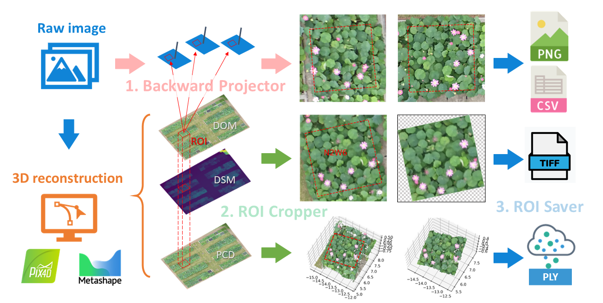

<div align="center">

<p>
   <!-- <a align="left" href="https://ultralytics.com/yolov5" target="_blank"> -->
   </a>
</p>

<p align="center">
  
  
  
  
  
</p>

<a href="README.md">English</a>

</div>
EasyIDP(中间数据处理助手)是一个处理三维重建(Metashape和Pix4D)产品上兴趣区域(ROI)的软件包(主要是农业应用)，提供如下的功能：

1. 把ROI反投影回原始图片上 (`Backward Projector`)
2. 在正射地图(DOM)、高程图(DSM)和点云上把ROI切出来 (`ROI Cropper`)
3. 把切块后的结果保存为对应文件格式 (`ROI Saver`)

本项目尽量使用纯python实现的第三方库，避免因为个别功能而去使用可能安装失败的GDAL库依赖包(GeoPandas, GDAL)和过于繁重的大型库(如Open3D, OpenCV)，因此效率和代码习惯上会有一些损失。

## <div align="center">文档</div>

完整的文档请查阅[官方文档](https://easyidp.readthedocs.io/zh_CN/latest/)。如果遇到问题，请移步[Github Discussion](https://github.com/UTokyo-FieldPhenomics-Lab/EasyIDP/discussions)。


## <div align="center">快速上手 (填坑中)</div>

可以通过PyPi来安装：

```bash
pip install easyidp
```

然后在你的python环境中导入包：

```python
import easyidp as idp
```

---

在执行下面的示例代码前，请确保基本理解了Metashape或Pix4D的图像三维重建的工作流程，并且知道如何导出地图(DOM和DSM的tiff文件格式)和点云(ply文件格式)。并且知道一些基本的GIS矢量文件(shp)的格式与制作方法。

> 请注意，如果你看到了这句话，说明下面的这些功能还没有完成

<details close>
<summary>1. 读取ROI</summary>

```python
roi = idp.ROI("xxxx.shp")  # 经纬度二维信息
  
# 从高程图DSM里获取高度信息
roi.get_z_from_dsm("xxxx_dsm.tiff")  # 增加高度成为三维信息
```

二维的ROI可以用来切正射地图、高程图和点云(参考`2.切ROI`)。三维点ROI可以用来反投影回原始图片上(参考`4.反投影`)。

  
或者你可以直接自动创建一个网格ROI：
  
```python
roi = idp.ROI(grid_h=300, grid_w=300, tif_path="xxxx.tif")
```
</details>

<details close>
<summary>2. 切ROI</summary>
  
读取正射地图和高程图文件
```python
dom = idp.GeoTiff("xxx_dom.tif")
dsm = idp.GeoTiff("xxx_dsm.tif")
```
  
读取点云文件
```python
ply = idp.PointCloud("xxx_pcd.ply")
```
  
把兴趣区域(ROI)切出来：
```python
dom_parts = roi.crop(dom)
dsm_parts = roi.crop(dsm)
pcd_parts = roi.crop(ply)
```

如果你想在切的时候，顺便保存切块的结果：
```python
dom_parts = roi.crop(dom, save_folder="./crop_dom")
dsm_parts = roi.crop(dsm, save_folder="./crop_dsm")
pcd_parts = roi.crop(ply, save_folder="./crop_pcd")
```
  
</details>

<details close>
<summary>3. 读取重建项目</summary>
  
把(同一块地的不同拍摄时间的时间序列)重建项目添加到处理池中：
  
```python
proj = idp.ProjectPool()
# Pix4D项目
proj.add_pix4d(["date1.p4d", "date2.p4d", ...])
# Metashape项目
proj.add_metashape(["date1.psx", "date2.psx", ...])
```

然后你可以按照下面两种方法获取每一个时间点：

```python
p1 = proj[0]
# or
p1 = proj["chunk_or_project_name"]
```

</details>

<details close>
<summary>4. 反投影</summary>
  
```python
>>> img_dict = roi.back2raw(chunk1)
```
  
然后检查运算结果：
```python
# 所有找到的原始图片
>>> img_dict.keys()   
dict_keys(['DJI_0177.JPG', 'DJI_0178.JPG', 'DJI_0179.JPG', 'DJI_0180.JPG', ... ]

# ROI在该图片上的像素坐标
>>> img_dict['DJI_0177.JPG'] 
array([[ 779,  902],
       [1043,  846],
       [1099, 1110],
       [ 834, 1166],
       [ 779,  902]])
```
 
保存反投影的图片结果：

```python
img_dict = roi.back2raw(chunk1, save_folder="folder/to/put/results/")
```
</details>


## <div align="center">相关参考</div>

如果您的研究受益于该项目，请引用我们的论文：

```latex
@Article{wang_easyidp_2021,
AUTHOR = {Wang, Haozhou and Duan, Yulin and Shi, Yun and Kato, Yoichiro and Ninomiya, Seish and Guo, Wei},
TITLE = {EasyIDP: A Python Package for Intermediate Data Processing in UAV-Based Plant Phenotyping},
JOURNAL = {Remote Sensing},
VOLUME = {13},
YEAR = {2021},
NUMBER = {13},
ARTICLE-NUMBER = {2622},
URL = {https://www.mdpi.com/2072-4292/13/13/2622},
ISSN = {2072-4292},
DOI = {10.3390/rs13132622}
}
```

我们也感谢下面所有开源工程对本项目的贡献：

* package main (**for users**)
  * numpy: [https://numpy.org/](https://numpy.org/)
  * matplotlib:[https://matplotlib.org/](https://matplotlib.org/)
  * pillow: [https://github.com/python-pillow/Pillow](https://github.com/python-pillow/Pillow)
  * pyproj: [https://github.com/pyproj4/pyproj](https://github.com/pyproj4/pyproj)
  * tifffile: [https://github.com/cgohlke/tifffile](https://github.com/cgohlke/tifffile)
  * imagecodecs: [https://github.com/cgohlke/imagecodecs](https://github.com/cgohlke/imagecodecs)
  * shapely: [https://github.com/shapely/shapely](https://github.com/shapely/shapely)
  * laspy/lasrs/lasio: [https://github.com/laspy/laspy](https://github.com/laspy/laspy)
  * plyfile: [https://github.com/dranjan/python-plyfile](https://github.com/dranjan/python-plyfile)
  * pyshp: [https://github.com/GeospatialPython/pyshp](https://github.com/GeospatialPython/pyshp)
  * tabulate: [https://github.com/astanin/python-tabulate](https://github.com/astanin/python-tabulate)
  * tqdm: [https://github.com/tqdm/tqdm](https://github.com/tqdm/tqdm)
  * gdown: [https://github.com/wkentaro/gdown](https://github.com/wkentaro/gdown)
* package documentation (**for developers**)
  * sphinx: [https://github.com/sphinx-doc/sphinx](https://github.com/sphinx-doc/sphinx)
  * nbsphinx: [https://github.com/spatialaudio/nbsphinx](https://github.com/spatialaudio/nbsphinx)
  * sphinx-gallery: [https://github.com/sphinx-gallery/sphinx-gallery](https://github.com/sphinx-gallery/sphinx-gallery)
  * sphinx-inline-tabs: [https://github.com/pradyunsg/sphinx-inline-tabs](https://github.com/pradyunsg/sphinx-inline-tabs)
  * sphinx-intl: [https://github.com/sphinx-doc/sphinx-intl](https://github.com/sphinx-doc/sphinx-intl)
  * sphinx-rtc-theme: [https://github.com/readthedocs/sphinx_rtd_theme](https://github.com/readthedocs/sphinx_rtd_theme)
  * furo: [https://github.com/pradyunsg/furo](https://github.com/pradyunsg/furo)
* package testing and releasing (**for developers**)
  * pytest: [https://github.com/pytest-dev/pytest](https://github.com/pytest-dev/pytest)
  * packaging: [https://github.com/pypa/packaging](https://github.com/pypa/packaging)
  * wheel: [https://github.com/pypa/wheel](https://github.com/pypa/wheel)

该项目的部分资金来自于：

* the JST AIP Acceleration Research “Studies of CPS platform to raise big-data-driven AI agriculture”; 
* the SICORP Program JPMJSC16H2; 
* CREST Programs JPMJCR16O2 and JPMJCR16O1; 
* the International Science & Technology Innovation Program of Chinese Academy of Agricultural Sciences (CAASTIP); 
* 国家自然科学基金U19A2061.