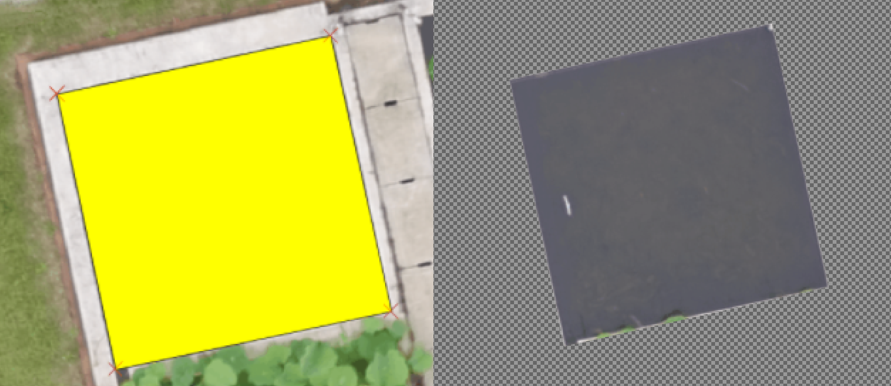

====================
GeoTiff Transparency
====================

Background
==========

In the most cases, the region of interest (ROI) is not perfectly fit the rectangle image boundary, and the other part is not what we need, and "mute" them will make the later analysis easier

For GeoTiff, there are two methods to mark the transparency part, for equalized RGB type or reflectance type respectively. Please check `Pix4D | Relectance map vs Orthomosaic <https://support.pix4d.com/hc/en-us/articles/202739409-Reflectance-map-vs-orthomosaic>`_ for more details.

1. provide an extra mask layer (channel), like PNG image format does. This suits for RGB GeoTiff type (e.g. Orthomosaic DOM). Their values are equalized and stretched into integer ranging from 0 to 255. This method can represent different transparency strength without lossing original pixel values.
#. change pixel value to -10000 (default, or other no-data value specified in geotiff tag). This method suits for Reflectance GeoTiff type (e.g. DSM, multispectral map). Their values are not stretched, and different layer has different value ranges

Check data
==========

For example, we have 2 different type of Geotiff data, ``index_trans.tif`` is reflectance map while ``mosaic_trans.tif`` is RGB map.

.. image:: ../_static/images/geotiff_transparency/ref_rgb.png
   :alt: ref_rgb.png

The data can be loaded by ``tifffile`` package or ``rasterio`` (hard to install sometimes, but please check the docs for more detail about GeoTiff masks: `RasterIO docs | Nodata Masks <https://rasterio.readthedocs.io/en/latest/topics/masks.html>`_)

.. code-block:: python

   >>> import tifffile as tf
   >>> tif_rgb = tf.TiffFile("mosaic_trans.tif")   # RGB map
   >>> tif_ref = tf.TiffFile("index_trans.tif")   # Reflectance map
   >>> page_rgb = tif_rgb.pages[0]  # read the first page of pyramid 
   >>> page_ref = tif_ref.pages[0]  # 读取金字塔的第一层

check Geotiff tags:

.. code-block:: python

   >>> print(page_ref.tags)
   TiffTag 256 ImageWidth @24 SHORT @36 17520
   TiffTag 257 ImageLength @44 SHORT @56 19056
   ...
   # nodata tag
   TiffTag 42113 GDAL_NODATA @384 ASCII[7] @396 -10000

check Geotiff values:

.. code-block:: python

   >>> page_rgb.asarray().shape  # RGB
   (19056, 17520, 4)
   >>> page_ref.asarray().shape  # reflectance
   (19056, 17520, 3)

RGB value and its range

.. code-block:: python

   >>> page_rgb.asarray()[:,:,2]  # the third layer 
   array([[0, 0, 0, ..., 0, 0, 0],
          [0, 0, 0, ..., 0, 0, 0],
          [0, 0, 0, ..., 0, 0, 0],
          ...,
          [0, 0, 0, ..., 0, 0, 0],
          [0, 0, 0, ..., 0, 0, 0],
          [0, 0, 0, ..., 0, 0, 0]], dtype=uint8)
   >>> page_rgb.asarray()[:,:,2].min()
   0
   >>> page_rgb.asarray()[:,:,2].max()
   255

Reflectance value and its range

.. code-block:: python

   >>> page_ref.asarray()[:,:,2]
   array([[-10000., -10000., -10000., ..., -10000., -10000., -10000.],
          [-10000., -10000., -10000., ..., -10000., -10000., -10000.],
          [-10000., -10000., -10000., ..., -10000., -10000., -10000.],
          ...,
          [-10000., -10000., -10000., ..., -10000., -10000., -10000.],
          [-10000., -10000., -10000., ..., -10000., -10000., -10000.],
          [-10000., -10000., -10000., ..., -10000., -10000., -10000.]],
          dtype=float32)
   >>> page_ref.asarray()[:,:,2].max()
   254.93721