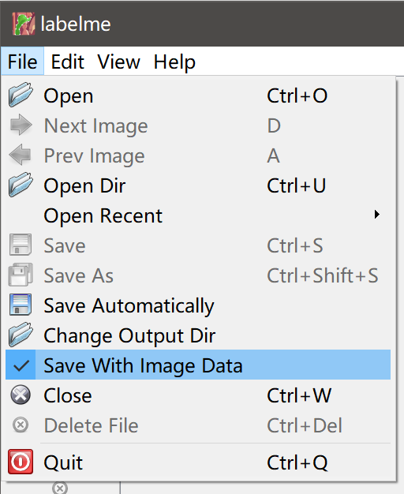
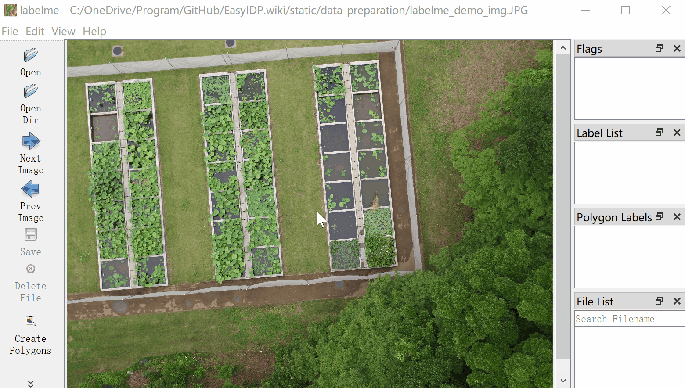
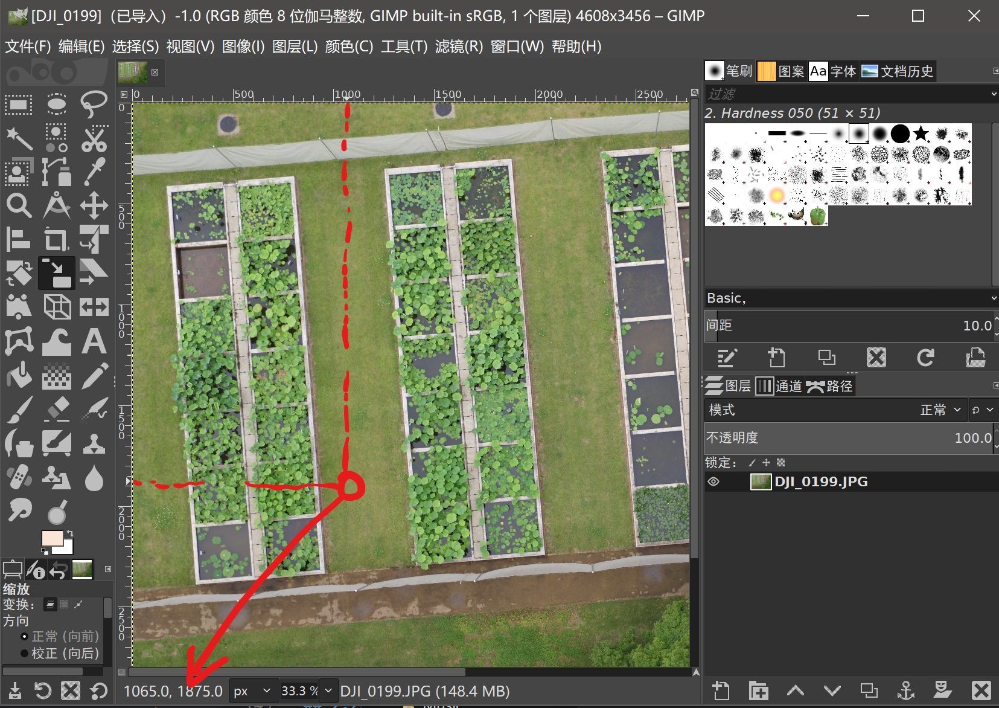
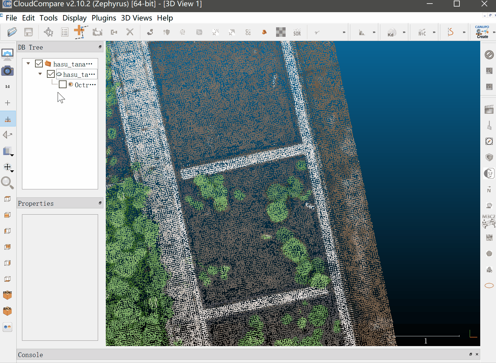
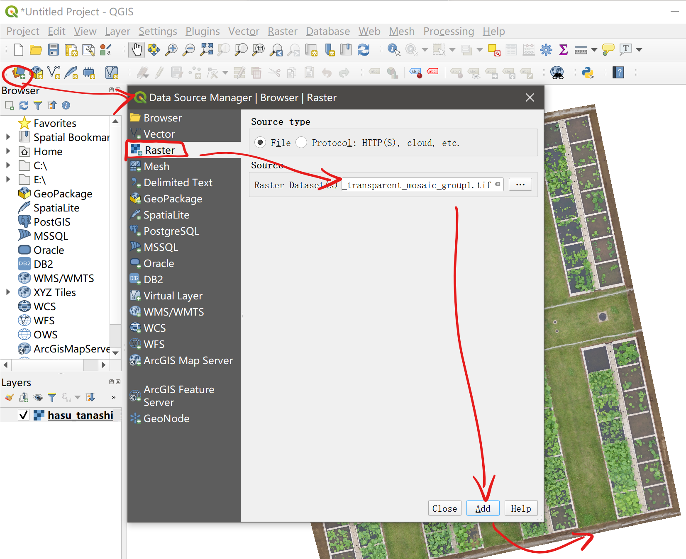
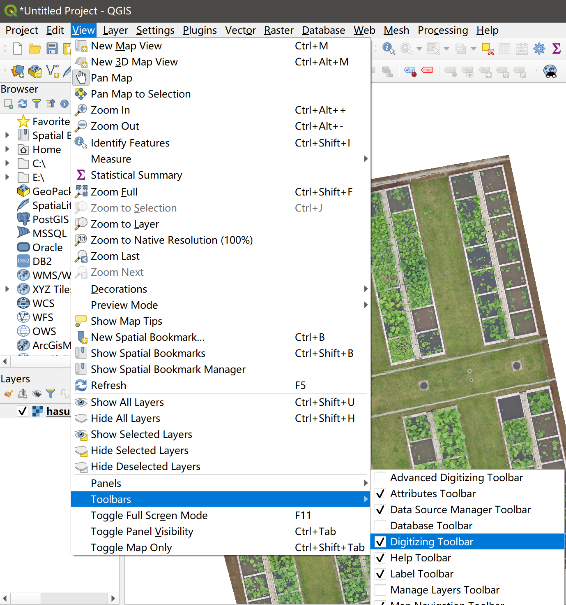
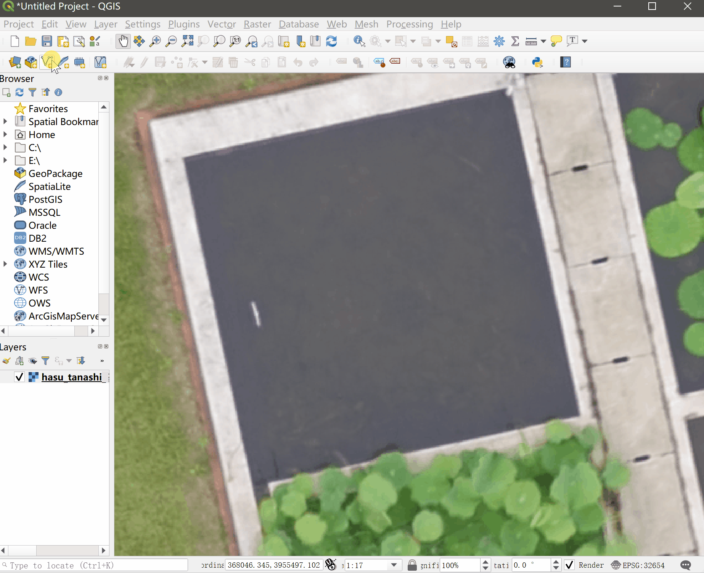
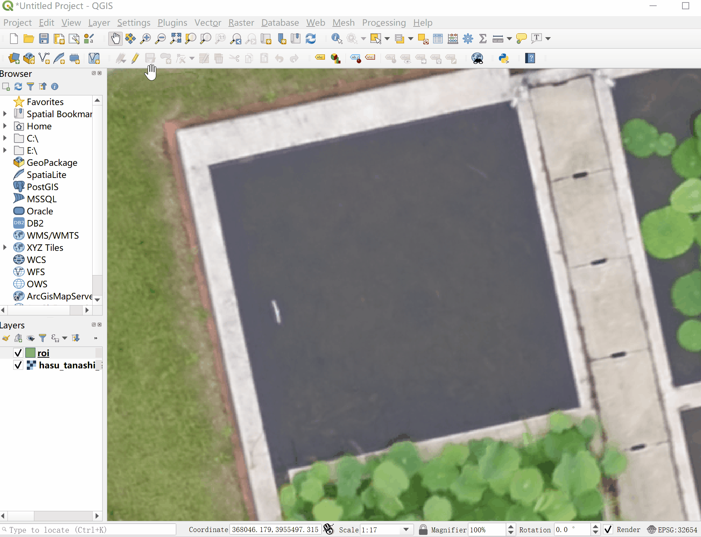

================================
Region of Interest (ROI) Marking
================================

1\. Marking ROI on digital images 
=================================

The `LabelMe <https://github.com/wkentaro/labelme>`_ is used to mark ROI on digital images, please refer to `releases <https://github.com/wkentaro/labelme/releases>`_ to download the execuatable file.

Demo image
--------------

Here is the domo image, and can be download by ``right click -> save image as`` or sinlge left click the image:

.. image:: ../_static/images/roi_marking/labelme_demo_img.JPG
    :alt: labelme_demo_img.JPG
    :target: ../_static/images/roi_marking/labelme_demo_img.JPG

Data annotation
-------------------

Firstly, before marking, remember to **cancel** the option ``Save with image data``, otherwise it will save full image data into final annotation json file and making the file size from 1kb to >5MB, unless you decide to share the annotation data without providing original image.

Then follow the aninamtion below to mark key points of ROI

It will save a annotation json file like below:

.. code-block:: json

    {
        "version": "4.5.6",
        "flags": {},
        "shapes": [
            {
            "label": "1",
            "points": [
                [
                2447.239263803681,
                1369.325153374233
                ],
                [
                2469.9386503067485,
                1628.2208588957053
                ],
                [
                2730.0613496932515,
                1605.5214723926379
                ],
                [
                2703.0674846625766,
                1348.4662576687115
                ]
            ],
            "group_id": null,
            "shape_type": "polygon",
            "flags": {}
            }
        ],
        "imagePath": "labelme_demo_img.JPG",
        "imageData": null,
        "imageHeight": 3456,
        "imageWidth": 4608
    }

The json file could be downloaded :download:`here <../_static/jsons/roi_marking/labelme_demo_img.json>`.

Annotation reading
------------------

The json file can be loaded by:

.. code-block:: python

    >>> import easyidp as idp
    >>> roi = idp.ROI("path/to/lableme.json")
    >>> roi[0]
    [[2447.2392638  1369.32515337]
     [2469.93865031 1628.2208589 ]
     [2730.06134969 1605.52147239]
     [2703.06748466 1348.46625767]]

Also, users can use any other software which can displace the coordinates where mouse hovered on, and recording the points directly in python codes, for the example below:

.. code-block:: python

    >>> import numpy as np
    >>> poly = np.asarray([
        [1065, 1875], 
        [...], 
        [...], ])

    >>> roi = idp.ROI()
    >>> roi[0] = poly
    

2\. Marking ROI on point cloud
==============================

The open source software `CloudCompare <http://cloudcompare.org/>`_ is used to mark ROI on point clouds based on point picking and save picked points to txt file. Users can also choosing other 3D software which can obtain the point coordinates, and saving ``x,y,z`` points to ``*.txt`` file.

ROI marking
-----------

The steps to getting a txt file is as follows, by using ``pick several points`` tools to pick points and saving only ``x,y,z`` to txt file.

.. attention::
    it is recommend to make only one ROI in one TXT file which benefits for ROI management, unless you have advanced python data processing skills to deal with mixed ROIs in one TXT file.

ROI reading
-----------

The produced TXT file looks like this, including 4 vertex by (x, y, z)

.. code-block:: text

    7.876980304718,-6.117620944977,-0.568696975708
    8.262033462524,-8.053977966309,-0.585714340210
    10.198881149292,-7.656465530396,-0.626638412476
    9.816680908203,-5.730380535126,-0.562286376953

It can be loaded by EasyIDP directly:

.. code-block:: python

    >>> import easyidp as idp
    >>> test_data = idp.roi.read_cc_txt(r'picking_list.txt')
    >>> test_data
    array([[ 7.8769803 , -6.11762094, -0.56869698],
           [ 8.26203346, -8.05397797, -0.58571434],
           [10.19888115, -7.65646553, -0.62663841],
           [ 9.81668091, -5.73038054, -0.56228638],
           [ 7.8769803 , -6.11762094, -0.56869698]])

.. hint::

    The original text only has 4 points:

    .. code-block:: python

        >>> test_data = np.loadtxt(r'picking_list.txt', delimiter=',')
        >>> test_data
        array([[ 7.8769803 , -6.11762094, -0.56869698],
               [ 8.26203346, -8.05397797, -0.58571434],
               [10.19888115, -7.65646553, -0.62663841],
               [ 9.81668091, -5.73038054, -0.56228638]])

    However, the definition of polygon requires the first point should be the last points, so the outputs of easyidp automatically add to the last line.

Due to each txt file contains only one polygon, currently need user manual add to ``ROI`` object like follows:

.. code-block:: python
    
    >>> roi = idp.ROI()
    >>> roi["pickling_list"] = test_data

.. todo::

    In the future, EasyIDP may provide an API to load all txt files in one folder as ``ROI`` object directly.
    

3\. Marking ROI on GIS maps
===========================

The open source `QGIS <https://www.qgis.org/en/site>`_ is used to make ``*.shp`` file of ROI on GIS maps, including DOM and DSM. Users can also select any other GIS software which produces standard ``*.shp`` file. The example map data can be downloaded from `here <https://github.com/UTokyo-FieldPhenomics-Lab/EasyIDP/releases/download/v0.1-alpha/lotus_170525.zip>`_:

Add Polygons
------------

Firstly, loading the maps into QGIS software:

And activate ``digitizing toolbar`` in ``view -> toolbars`` if not activated:

Then clicking ``new shapefile layer`` in the ``Data Source Manager Toolbar``, specify the shp file name and path, changing geometry type to ``polygon`` and projection system to ``Project: xxx``, and add a text field called label (or delete original ``id`` if you want), press ok to finish.

Click ``Toggle Editing`` in the ``Digitizing toolbar``, then click ``add polygon feature`` button, the mouse will change to scope symbol, clicking the vertex of roi, right click to close polygon, and type labels to finish.

Repeat previous steps until all ROI are marked.

.. admonition:: How to move or duplicate ROI 
    :class: note
    
    Activate ``Advanced digitizing toolbar`` and ``Attributes toolbar`` in ``view -> toolbars`` if not activated

    click ``Select feature by area or single click`` button in ``Attributes toolbar``, and select target roi (its vertex will change to red cross after selection); click ``copy and move feature`` button in ``advanced digitizing toolbar``, the dropdown column will switch between move and copy.

    .. image:: ../_static/images/roi_marking/qgis_mv_roi.gif
        :alt: qgis_mv_roi.gif
        

.. admonition:: How to make advanced shape ROI 
    :class: note

    Activate ``Shape digitizing toolbar`` in ``view -> toolbars`` and if not activated

    .. image:: ../_static/images/roi_marking/qgis_adv_roi.gif
        :alt: qgis_adv_roi.gif

    It provides advanced options for circular string, add circle, add ellipse, add rectangle, and add regular polygon.

Read shp file
-------------

In this example, the `plots.shp` file using default projection system EPSG 4326 which default value is (latitude, longitude).

.. code-block:: python

    >>> import easyidp as idp
    >>> roi = idp.ROI()
    >>> roi.read_shp(r'roi/plots.shp', name_field=0)
    >>> roi.crs.name 
    "WGS 84"
    >>> roi["N1W2"]
    array([[ 35.73473289, 139.54053488],
           [ 35.73473691, 139.54055632],
           [ 35.73471937, 139.54056118],
           [ 35.73471541, 139.54053963],
           [ 35.73473289, 139.54053488]])

.. todo::
    The shp file only provides 2D coordinates, while 3D geography coordinates is needed for further calculation. The DSM can provides the height value. And the 3D coordinates can be obtained by combining shp and DSM file together. For more details about this, please refer to :doc:`../index`