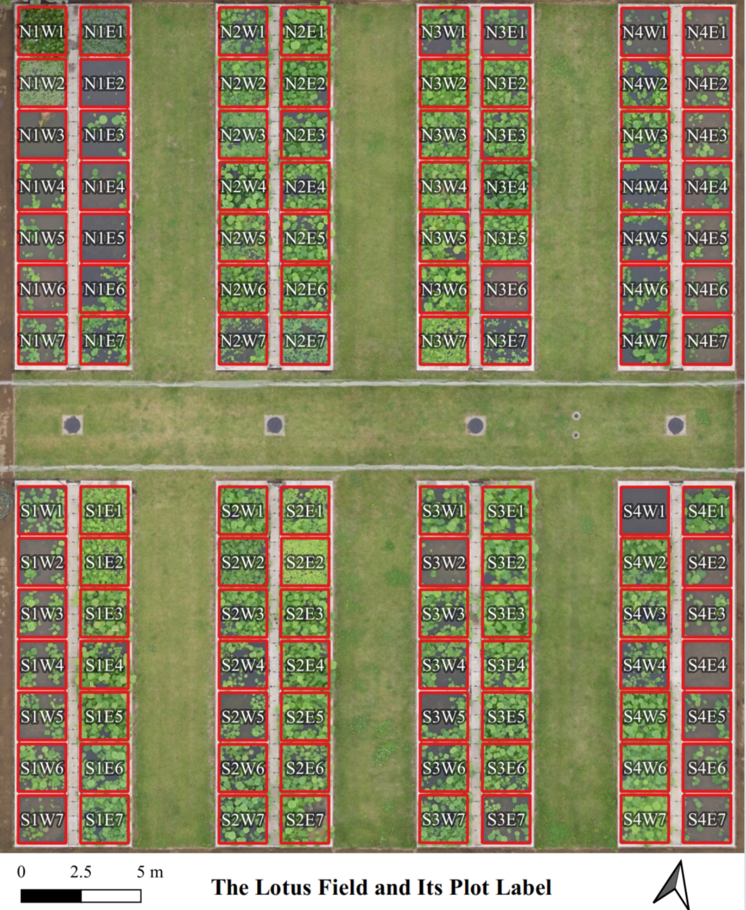

============
Data
============

Dataset
=======

All the dataset is in the following format:

.. autoclass:: easyidp.data.EasyidpDataSet
   :members: 
   :special-members: __init__

**Usage**

.. code-block:: python

    >>> import easyidp as idp
    >>> lotus = idp.data.Lotus()
    Downloading...
    From: https://drive.google.com/uc?id=1SJmp-bG5SZrwdeJL-RnnljM2XmMNMF0j
    To: C:\Users\<user>\AppData\Local\easyidp.data\2017_tanashi_lotus.zip
    100%|█████████████████████████████| 3.58G/3.58G [00:54<00:00, 65.4MB/s]
    >>> lotus.shp
    'C:\\Users\\<user>\\AppData\\Local\\easyidp.data\\2017_tanashi_lotus\\plots.shp'
    >>> lotus.metashape.proj
    'C:\\Users\\<user>\\AppData\\Local\\easyidp.data\\2017_tanashi_lotus\\170531.Lotus.psx'
    >>> lotus.photo
    'C:\\Users\\<user>\\AppData\\Local\\easyidp.data\\2017_tanashi_lotus\\20170531\\photos'
    >>> lotus.pix4d.param
    'C:\\Users\\<user>\\AppData\\Local\\easyidp.data\\2017_tanashi_lotus\\20170531\\params'

Here have the following dataset: 

TanashiLotus2017
----------------

- **Crop** : lotus
- **Location** : Tanashi, Nishi-Tokyo, Japan
- **Flight date** : May 31, 2017
- **UAV model** : DJI Inspire 1
- **Flight height** : 30m
- **Image number** :142
- **Image size** : 4608 x 3456
- **Software** : Pix4D, Metashape
- **Outputs** : DOM, DSM, PCD

Functions
=========

.. autosummary:: 
    :toctree: autodoc

    easyidp.data.user_data_dir
    easyidp.data.show_data_dir